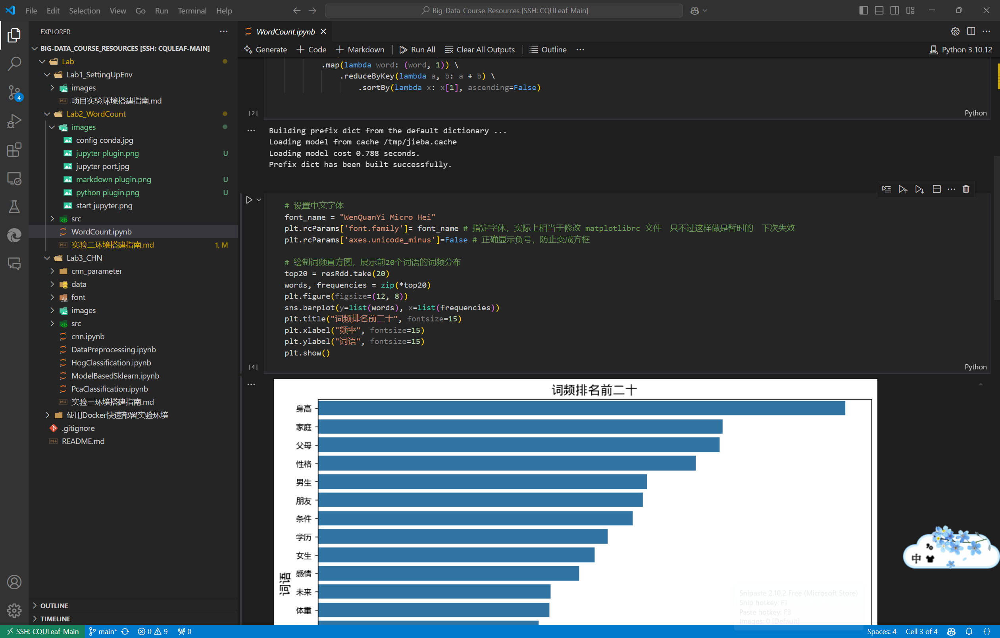

# 搭建实验二运行环境

- [搭建实验二运行环境](#搭建实验二运行环境)
  - [实验目的](#实验目的)
  - [搭建 Anaconda 与 Jupyter Notebook](#搭建-anaconda-与-jupyter-notebook)
    - [第一步：更新软件安装包](#第一步更新软件安装包)
    - [第二步：下载并安装 Anaconda](#第二步下载并安装-anaconda)
    - [第三步：配置 Anaconda](#第三步配置-anaconda)
    - [第四步：创建实验虚拟环境并配置 Jupyter](#第四步创建实验虚拟环境并配置-jupyter)
    - [第五步：开始使用 Jupyter Notebook](#第五步开始使用-jupyter-notebook)
  - [VSCode 连接云服务器进行远程开发](#vscode-连接云服务器进行远程开发)
    - [一些好用的插件分享](#一些好用的插件分享)
    - [远程连接的大致效果](#远程连接的大致效果)
  - [Linux 中使用matplotlib库绘图时中文字体配置](#linux-中使用matplotlib库绘图时中文字体配置)
    - [第一步：下载中文字体](#第一步下载中文字体)
    - [第二步：显示matplotlib库的字体文件夹](#第二步显示matplotlib库的字体文件夹)
    - [第三步：复制下载的字体到matplotlib库的字体文件夹](#第三步复制下载的字体到matplotlib库的字体文件夹)
    - [第四步：完成权限的更改](#第四步完成权限的更改)
    - [第五步：在matplotlib使用中文字体](#第五步在matplotlib使用中文字体)

## 实验目的

1. 安装并配置好 Anaconda
2. 安装并配置好 Jupyter Notebook
3. 学会使用 VSCode 远程连接至云服务器进行开发
4. 配置 Linux 中的中文字体

## 搭建 Anaconda 与 Jupyter Notebook

### 第一步：更新软件安装包

```bash
sudo apt-get update && sudo apt-get upgrade -y
```

### 第二步：下载并安装 Anaconda

1. 下载 Anaconda

    ```bash
    wget https://repo.anaconda.com/archive/Anaconda3-2024.06-1-Linux-x86_64.sh
    ```

2. 安装 Anaconda

    ```bash
    bash Anaconda3-2024.06-1-Linux-x86_64.sh
    ```

    - 安装过程一直点`Enter`键即可。
    - 出现Do you accept User lincense terms？ [yes|no]: yes（选择yes即可）
    - 出现选择改文件存放的文件夹路径，可以直接默认点`Enter` （当然也可以自定义设置）
    - 出现You can undo this by running `conda init --reverse $SHELL`？ [yes|no]: no（选择no即可）

    终端显示: Thank you for installing Anaconda3! 表明**安装成功**

### 第三步：配置 Anaconda

1. 初始化

    ```bash
    source ~/anaconda3/bin/activate
    conda init
    ```

2. 设置打开终端不自动进入 conda 的 base 环境，这允许我们可以自由选择进入的环境（可选，不是必做，根据个人使用习惯）

    ```bash
    source ~/.bashrc 
    conda config --set auto_activate_base false
    ```

    如果想**重新启用**这一功能，则：

    ```bash
    conda config --set auto_activate_base true
    ```

3. 更新配置并验证是否安装并启动成功

    ```bash
    source ~/.bashrc
    conda --version
    conda env list
    ```

    
    如果显示版本号和环境列表，则表示**安装并启动成功**。

### 第四步：创建实验虚拟环境并配置 Jupyter

1. 创建一个新的 conda 虚拟环境

    ```bash
    conda create -n big_data_lab_env python=3.10
    ```

    该虚拟环境名字为 `big_data_lab_env` 且对应的Python版本为 $3.10$。这两处内容都可以**自定义**。

    ```bash
    conda activate big_data_lab_env
    ```

    激活虚拟环境

2. 安装并配置 Jupyter

    1. 在刚刚创建的虚拟环境中安装 Jupyter

        ```bash
        conda install -c conda-forge jupyter
        ```

    2. 生成 Jupyter Notebook 配置文件

        ```bash
        jupyter notebook --generate-config
        ```

    3. 输入指令设置密码保存密钥

        ```bash
        jupyter notebook password
        ```

        终端输入如上命令后会提示你输入密码并再输入一次来确定，完成之后其会**自动**生成一个加密的密码（密钥）并将其保存到配置文件中。以后我们使用 Jupyter Notebook 时可以使用该密码进行访问。

    4. 配置 Jupyter 环境

        ```bash
        sudo nano /home/ecs-user/.jupyter/jupyter_notebook_config.py
        ```

        注意这里路径中的 `ecs-user` 可能你的会不同，你可以看 ii 中生成配置文件保存的路径。

        在这份文件中任意位置加入下列配置内容即可：

        ```python
        c.NotebookApp.ip = '0.0.0.0'
        c.NotebookApp.port = 8888
        c.NotebookApp.open_browser = False
        c.NotebookApp.password = ''
        ```

至此，配置工作全部完成！！！

### 第五步：开始使用 Jupyter Notebook

```bash
jupyter notebook
```

终端键入如上命令，即可开启 Jupyter Notebook，之后将弹出如下启动信息。


在浏览器中访问公网ip下的 $8888$ 端口就可以开始使用了！！

之后会弹出登录界面，输入你自己设置的密码即可。

> 如此启动方式会有一些不方便之处，具体如下：
>
> 1. 终端会被占用并显示 Jupyter 的日志信息，在此期间我们不能输入其他指令。
> 2. 一旦我们关闭 Xshell 7窗口后，Jupyter Notebook 会停止运行，我们也无法访问公网ip上的网页了。
>

所以下面说一下让其后台运行的方法：

输入这个启动命令即可

```bash
nohup jupyter notebook &
```

命令执行后会输出一个 PID，可以用于后面的关闭进程操作。如果后面不想一直开启这个 Jupyter Notebook，就输入下面这个命令，将 `PID` 换成刚刚输出的 PID 即可。

```bash
kill <PID>
```

如果你忘记了这个 PID，你可以输入这行命令来查询：

```bash
ps aux | grep jupyter
```

## VSCode 连接云服务器进行远程开发

> 该部分较简单，且原教程已经很详细了，可参考[实验二指南](https://github.com/Wanghui-Huang/CQU_bigdata/blob/master/Experiment/Ex2_WordCount/ex2.md)，在此不再进行赘述。

### 一些好用的插件分享

> 这里推荐一些好用的插件来方便本次实验的进行

1. Jupyter相关插件

    

2. Markdown相关插件

    

3. Python相关插件

    

### 远程连接的大致效果



实际上，跟我们平常使用的本地效果基本一致，对我们开发非常友好！

## Linux 中使用matplotlib库绘图时中文字体配置

### 第一步：下载中文字体

Ubuntu的字体目录在 `/usr/share/fonts` 下，自带的中文字体很烂，需要我们先下载中文字体库。

```bash
sudo apt install fonts-wqy-zenhei fonts-wqy-microhei
```

这样，字体就会下载到 `/usr/share/fonts/truetype/wqy` 文件夹下了。

### 第二步：显示matplotlib库的字体文件夹

```python
import matplotlib
matplotlib.matplotlib_fname()
```

我的显示为这样：`/home/ecs-user/anaconda3/envs/big_data_lab_env/lib/python3.10/site-packages/matplotlib/mpl-data/fonts/ttf`

### 第三步：复制下载的字体到matplotlib库的字体文件夹

```bash
sudo cp /usr/share/fonts/truetype/wqy/wqy-microhei.ttc /home/ecs-user/anaconda3/envs/big_data_lab_env/lib/python3.10/site-packages/matplotlib/mpl-data/fonts/ttf/
```

删除对应缓存文件（可选）

```bash
cd ~/.cache/matplotlib
rm -rf *.*
```

### 第四步：完成权限的更改

```bash
sudo chown ecs-user:ecs-user /home/ecs-user/anaconda3/envs/big_data_lab_env/lib/python3.10/site-packages/matplotlib/mpl-data/fonts/ttf/wqy-microhei.ttc
sudo chmod 644 /home/ecs-user/anaconda3/envs/big_data_lab_env/lib/python3.10/site-packages/matplotlib/mpl-data/fonts/ttf/wqy-microhei.ttc
```

### 第五步：在matplotlib使用中文字体

在需要使用时加入对应的 python 代码即可。

```python
# 设置中文字体
font_name = "WenQuanYi Micro Hei"
plt.rcParams['font.family']= font_name # 指定字体，实际上相当于修改 matplotlibrc 文件　只不过这样做是暂时的　下次失效
plt.rcParams['axes.unicode_minus']=False # 正确显示负号，防止变成方框
```
