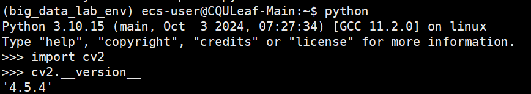

# 搭建实验三运行环境

- [搭建实验三运行环境](#搭建实验三运行环境)
  - [实验目的](#实验目的)
  - [下载`OpenCV-Python`库](#下载opencv-python库)
    - [第一步：选择合适的镜像源和文件](#第一步选择合适的镜像源和文件)
    - [第二步：在之前创建的 `conda` 环境中直接下载对应库](#第二步在之前创建的-conda-环境中直接下载对应库)
    - [第三步：验证是否安装成功](#第三步验证是否安装成功)
  - [解决使用分布式系统时的小问题](#解决使用分布式系统时的小问题)
    - [问题一：请确保你的 Spark 与 Hadoop 之间版本的兼容](#问题一请确保你的-spark-与-hadoop-之间版本的兼容)
    - [问题二：请确保你分布式各台机器端口全部放开](#问题二请确保你分布式各台机器端口全部放开)
    - [问题三：请确保你没有使用被弃用的 `mllib` 库](#问题三请确保你没有使用被弃用的-mllib-库)
    - [问题四：如果使用新版 `django` 请确保你相应地修改代码](#问题四如果使用新版-django-请确保你相应地修改代码)

## 实验目的

在前面两次实验的基础上加以补充，来完成本次实验，主要有：

1. 下载与使用 `OpenCV-Python` 库
2. 解决使用分布式时所遇问题

> 如果你使用的是 hadoop 或 spark 较新（3 以上的）的版本，请格外注意**解决使用分布式时所遇问题**这一部分，一些隐藏的问题很大可能导致实验不成功！

## 下载`OpenCV-Python`库

### 第一步：选择合适的镜像源和文件

> 这里提供[清华镜像源](https://mirrors.tuna.tsinghua.edu.cn/pypi/web/simple/opencv-python/)，可以在其中选择合适镜像文件

因为我们的系统是**Ubuntu 22.04 LTS**且**Python版本为3.10**，对应选择***opencv_python-4.5.4.60-cp310-cp310-manylinux_2_17_x86_64.manylinux2014_x86_64.whl***。cp310对应Python 3.10，注意这个即可，同时下面下载安装时会使用 `4.5.4.60` 这个版本号，如果你选择了其它，请注意更改对应下载命令。

### 第二步：在之前创建的 `conda` 环境中直接下载对应库

```bash
conda activate big_data_lab_env
pip install opencv-python==4.5.4.60 --index-url https://pypi.tuna.tsinghua.edu.cn/simple
```

### 第三步：验证是否安装成功



如果如上显示，则证明成功！

## 解决使用分布式系统时的小问题

> 注意：该部分仍然是建立在原教程之上，详见[实验三：中文手写数字分类](https://github.com/Wanghui-Huang/CQU_bigdata/blob/master/Experiment/Ex3/Ex3_CHN/ex3.md)

### 问题一：请确保你的 Spark 与 Hadoop 之间版本的兼容

> 如果不兼容可能导致任务提交出错。

因为我们搭建的是 Hadoop + Spark 的分布式环境，所以 Spark 与 Hadoop 在执行任务时是紧密结合的，Spark 需要从 Hadoop 中读取与存储数据的。如果你两者的版本不匹配，比如 Spark 为 3 以上的版本而 Hadoop 还是 2 的版本，则很大概率在执行任务时遇到问题，而且很难发觉！

看版本是否兼容可以在[Spark镜像站](https://repo.huaweicloud.com:8443/artifactory/apache-local/spark/)这里查看。


比如我这里的 Spark 3.5.1 就可以与 hadoop3 兼容，而无法与 2 兼容。


又比如这 Spark 3.0.3 对应也有不同的可兼容 Hadoop 版本。

当然，你也可以单独去网上确认你的 Spark 与 Hadoop 版本是否兼容。

### 问题二：请确保你分布式各台机器端口全部放开

> 如果不放开全部端口，也可能导致任务提交出错。

因为可能由于版本问题以及任务执行情况（猜测），原教程放开的指定部分端口可能漏了一些，但是却不清楚具体是哪些，所以推荐放开全部端口，这样就一定没有端口问题了！

### 问题三：请确保你没有使用被弃用的 `mllib` 库

> 如果使用被弃用的 `mllib` 库可能在执行任务时代码报错。

Spark 中关于机器学习的库 `mllib` 在 3 以上的版本已经被替换为 `ml` 库，相应地也做了一定的优化。 代码具体如何写，可以参考[实验三Spark新版逻辑回归任务代码](https://github.com/CQULeaf/Big-Data_Course_Resources/blob/main/Lab/Lab3_CHN/LRStandalone.py)来正确使用库进行任务的提交！

### 问题四：如果使用新版 `django` 请确保你相应地修改代码

> 如果你没有修改对应代码，在运行时会报很多错误，皆是因为版本不兼容。

`django` 版本跨度较大，不兼容地方可能较多，你可以选择回退到 2.1.8 版本，但是可能与你使用的其它库不兼容而出现新的问题。如果你使用的是新版 `django` 5.1 版本，可以参考[实验三Web部署模型代码](https://github.com/CQULeaf/Big-Data_Course_Resources/tree/main/Lab/Lab3_CHN/handwrittenWords_frontend)，只需要注意对应文件即可（可以根据报错来进行修改，报一个错改一个地方）。
