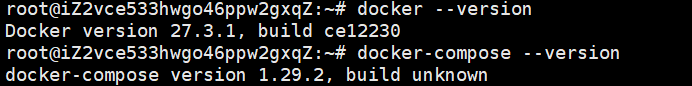

# Docker 快速部署实验环境指南

> 为什么选择使用 Docker 部署环境？它有什么突出优势？建议浏览[Docker真香定律](https://www.zhihu.com/question/400400231)

## 概述

## 详细构建过程

### 第一步：在云服务器上安装 Docker

可以说，当选择使用 Docker 部署环境时，最复杂的一步反倒变成安装 Docker 了（因为后面只用在 Docker 中敲几行命令即可完成环境搭建工作，真正实现开箱即用）

而对于**阿里云服务器**，其又提供了自动安装 Docker 的操作，见[阿里云服务器安装Docker并使用指南](https://help.aliyun.com/zh/ecs/use-cases/install-and-use-docker-on-a-linux-ecs-instance#298a8c6bdc193)，由于该指南非常详细清晰且本身操作简单，故不在此再次赘述。

键入以下命令查看是否安装成功，返回版本号即表示成功。

```bash
docker --version
docker-compose --version
```



### 第二步：部署 Spark 集群

1. 选择官方镜像进行拉取
    我们选择 `bitnami/spark` 镜像，其已超过百万次下载，是一个成熟的 Spark Docker 方案，此外选择它的另一重要原因是它的文档齐全，且更新频率快。

    拉取最新镜像

    ```bash
    docker pull bitnami/spark:latest
    ```

    查看镜像信息

    ```bash
    docker images
    ```

2. 新建工作目录并编写 YAML 文件
   1. 新建目录

        ```bash
        mkdir -p ~/docker/spark
        cd ~/docker/spark
        ```

   2. 编写`docker-compose.yml`文件

        ```bash
        vim docker-compose.yml
        ```

        复制粘贴 `docker-compose.yml` 里面的内容，特别注意**缩进**！！！

