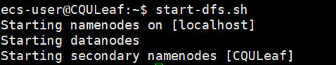
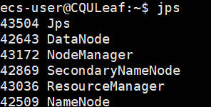
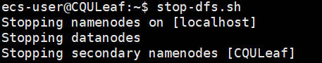

# 搭建本项目实验环境

## 一、实验目的

核心目标：完成 Hadoop & Spark 单机版以及分布式环境搭建。

最终需搭建相关详细环境如下：

1. 操作系统：Ubuntu 22.04 LTS
2. 辅助工具：Xshell 7, Xftp 7 以及 Xmanager 7
3. 语言环境：OpenJDK 1.8.0
4. 相关软件：Hadoop 3.3.6 以及 Spark 3.5.2

## 二、云服务器购买与配置

本项目使用阿里云提供的云服务器，操作系统选Ubuntu 22.04 LTS，配置云服务器较为简单，不在此详细说明，强烈建议跟着[实验零：Linux 初识](https://github.com/Wanghui-Huang/CQU_bigdata/blob/master/Experiment/Ex0_HelloLinux/ex0.md)走一遍！大部分是一致的，只有云厂商和操作系统有些许差别。

## 三、机器配置

此刻，你应当购买且配好了云服务器与Xshell等工具，且已经用Xshell 7连上了自己的云服务器，面前应该就是一台空白的机器了，下面将开始**使用命令行**配置你的机器！


### 第一步：更新软件安装包

```bash
sudo apt-get update && sudo apt-get upgrade -y
```

这一步是在进行任何配置之前都要做的，特别是对于一台全新机器时，这一步将进行较长时间！

***

### 第二步：安装Java并配置环境变量

1. 安装Java

    ```bash
    sudo apt-get install openjdk-8-jdk -y
    ```

2. 检验是否安装成功

    ```bash
    java -version
    ```

    若操作成功，会显示如下版本信息
    

    注意，你此时其实还并未配置 `JAVA_HOME` 环境变量，虽然你的确能够使用 `java -version` 查看 Java 版本。`JAVA_HOME` 环境变量通常用于一些需要明确知道 Java 安装目录的应用程序（如我们将要使用的 Hadoop、Spark），所以我们**仍然**要进行环境变量的配置。

3. 配置 `JAVA_HOME` 环境变量

    ```bash
    nano ~/.bashrc
    ```

    在最下方随便找个空白位置键入如下内容

    ```bash
    export JAVA_HOME=/usr/lib/jvm/java-8-openjdk-amd64
    export PATH=$PATH:$JAVA_HOME/bin
    ```

    键入完毕，按 `Ctrl O` 保存，回车一下，再按 `Ctrl X` 退出。

    退出后运行下述命令使配置生效

    ```bash
    source ~/.bashrc
    ```

    验证环境变量是否正常配置

    ```bash
    echo $JAVA_HOME
    ```

    正常情况下会显示如下内容

    

    >如果你严格按指南进行，则大概率可以直接复制粘贴环境变量内容，但如果你不确定自己的 Java 位置，可以输入如下指令查看

    ```bash
    sudo update-alternatives --config java
    ```

***

### 第三步：安装与配置Hadoop

> 注意下载Hadoop安装包我们将选择**华为源**，下载速度快且版本全。

1. 下载并安装Hadoop

    1. 下载安装包

        ```bash
        wget --no-check-certificate https://repo.huaweicloud.com/apache/hadoop/common/hadoop-3.3.6/hadoop-3.3.6.tar.gz
        ```

    2. 解压安装包

        ```bash
        tar -xzf hadoop-3.3.6.tar.gz
        ```

    3. 移动解压后的文件夹位置（可选但强烈建议，以便系统管理）

        > 如果你选择不移动文件夹位置，则注意在下面配置系统环境变量时填入正确的自己的路径。而如果选择按我这样移动，则可以直接复制粘贴对应的环境变量内容！

        ```bash
        sudo mv hadoop-3.3.6 /usr/local/hadoop
        ```

        > 解压后你可以选择删除压缩包

        ```bash
        rm hadoop-3.3.6.tar.gz
        ```

2. 配置 `HADOOP_HOME` 环境变量

    1. 打开对应文件

        ```bash
        nano ~/.bashrc
        ```

    2. 在最下方加上如下内容

        ```bash
        # Hadoop environment variables
        export HADOOP_HOME=/usr/local/hadoop
        export HADOOP_CONF_DIR=$HADOOP_HOME/etc/hadoop
        export PATH=$PATH:$HADOOP_HOME/bin:$HADOOP_HOME/sbin
        ```

    3. 键入完毕，按 `Ctrl O` 保存，回车一下，再按 `Ctrl X` 退出。

    4. 退出后运行下述命令使配置生效

        ```bash
        source ~/.bashrc
        ```

    5. 验证环境变量是否正常配置

        ```bash
        echo $HADOOP_HOME
        ```

        成功配置将显示以下内容
        

3. 验证 Hadoop 是否安装成功

    ```bash
    hadoop version
    ```

    成功配置将显示以下内容

    

4. 配置 Hadoop
    如果你不熟悉 vim，我推荐使用 Xftp 7 直接在记事本上修改，简单粗暴！（当然你也可以命令行中使用vim来修改文件内容）

    > 聪明的你肯定也会意识到，刚刚配置环境变量也可以直接在记事本上修改！！

    你需要导航到这个界面（通过在Xftp 7中点点点）
    
    然后关注四个文件，`hadoop-env.sh`、`yarn-env.sh`以及`core-site.xml`、`hdfs-site.xml`

    - 在`hadoop-env.sh`与`yarn-env.sh`中
    在文件最后面加上一行（两者同理）

        ```bash
        export JAVA_HOME=/usr/lib/jvm/java-8-openjdk-amd64
        ```

        

    - 在`core-site.xml`、`hdfs-site.xml`中

        在`core-site.xml`文件后面加上这些：

        ```xml
        <configuration>
            <property>
                <name>hadoop.tmp.dir</name>
                <value>file:/opt/hadoop/tmp</value>
                <description>location to store temporary files</description>
            </property>
            <property>
                <name>fs.defaultFS</name>
                <value>hdfs://localhost:9000</value>
            </property>
        </configuration>
        ```

        实际情况如下

        

        在`hdfs-site.xml`文件后面加上这些：

        ```xml
        <configuration>
            <property>
                <name>dfs.replication</name>
                <value>1</value>
            </property>
            <property>
                <name>dfs.namenode.name.dir</name>
                <value>file:/opt/hadoop/tmp/dfs/name</value>
            </property>
            <property>
                <name>dfs.datanode.data.dir</name>
                <value>file:/opt/hadoop/tmp/dfs/data</value>
            </property>
        </configuration>
        ```

        实际情况如下
        

5. 配置SSH无密码登录

    1. 生成 SSH 密钥

        ```bash
        ssh-keygen -t rsa -P "" -f ~/.ssh/id_rsa
        ```

    2. 将公钥添加到 `authorized_keys`

        ```bash
        cat ~/.ssh/id_rsa.pub >> ~/.ssh/authorized_keys
        chmod 600 ~/.ssh/authorized_keys
        ```

    3. 测试本地主机能否无密码登录成功

        ```bash
        ssh localhost
        ```

    4. 命令执行后显示的是你一开始的登录界面，说明配置成功
        

    5. 为远程主机配置无密码访问（以我的 `CQULeaf` 为例，你需要替换成对应的主机名 `hostname`）

        ```bash
        ssh-copy-id ecs-user@CQULeaf
        ```

    6. 测试远程主机无密码登录

        ```bash
        ssh CQULeaf
        ```

        命令执行后显示的是你一开始的登录界面，说明配置成功
        

6. 解决一些权限问题

    如果你当前用户非 `root` 用户，比如我目前是 `ecs-user`，需要解决一些权限问题。

    > 但请注意，在开通云服务器并创建用户时，阿里云就建议使用 `ecs-user` 而不要直接使用 `root`，太高的权限并不一定好。
  
   1. 解决 hadoop 日志目录权限问题

       ```bash
       sudo mkdir -p /usr/local/hadoop/logs
       sudo chown -R ecs-user:ecs-user /usr/local/hadoop/logs
       ```

       确保当前用户（ecs-user）拥有对日志目录的写权限。

   2. 解决设置进程优先级问题

        非 `root` 用户没有足够的权限来通过 `nice` 命令更改进程的优先级，会导致一会儿运行 hadoop 报错。

        还是修改 `hadoop-env.sh` 文件（上面已经改过一次了）

        

        使用Xftp 7用记事本打开 `hadoop-env.sh` 文件，找到`# export HADOOP_NICENESS=0`这一行，**去掉注释**即可！（如上图，只有一行没有注释，很容易看出来）

7. 云服务器打开相应端口

    请在云厂商云服务器管理控制台的安全组中开放**以下所有**端口，否则无法正常运行 hadoop 与 spark

    

    > 开放的端口不仅包含 hadoop 必需的，还有 spark 必需的，所以显得有点多，不过下面 spark 配置时就不用再来开放端口了。
    > 如果运行不成功，有很大可能是端口有些没有放通哦~

8. 运行 hadoop

   1. 启动 HDFS

       ```bash
       start-dfs.sh
       ```

       正确运行结果如下：
       

   2. 启动 YARN

       ```bash
       start-yarn.sh
       ```

       正确运行结果如下：
       

   3. 检查进程

       ```bash
       jps
       ```

       正确运行结果如下：
       

       > 正常会有 $6$ 个进程，缺一不可！！说明有问题，你没有配置成功！！

   4. 检查 Hadoop Web UI

       先检查 HDFS NameNode Web UI，查看 HDFS 状态。

       - 浏览器输入`http://<your-server-ip>:9870/`，将`<your-server-ip>`改为你的云服务器的公网ip地址即可。

       - 显示如下界面说明成功：
       

       再检查 YARN ResourceManager Web UI，查看 YARN 状态。

       - 浏览器输入`http://<your-server-ip>:8088/`，将`<your-server-ip>`改为你的云服务器的公网ip地址即可。

       - 显示如下界面说明成功：
       

9. 关闭 hadoop

    > 因为云服务器特性，如果你不手动关闭 hadoop，即使关了 Shell 软件仍然在运行，所以当你不用的时候可以手动关闭 hadoop

   1. 关闭 HDFS

       ```bash
       stop-dfs.sh
       ```

       正确运行结果如下：
       

   2. 启动 YARN

       ```bash
       stop-yarn.sh
       ```

       正确运行结果如下：
       

   3. 检查进程

       ```bash
       jps
       ```

       正确运行结果如下：
       

       > $5$ 个进程没有了！！说明关闭成功！！

10. 至此 Hadoop 配置完成！！！！

***

### 第四步：安装与配置Spark
