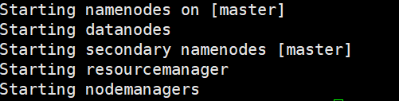
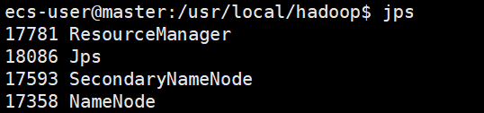
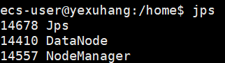
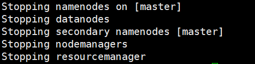
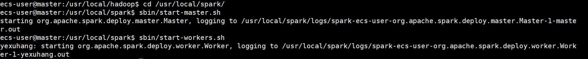
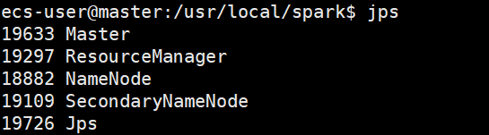
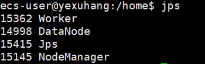

# 搭建本项目实验环境

- [搭建本项目实验环境](#搭建本项目实验环境)
  - [一、实验目的](#一实验目的)
  - [二、云服务器购买与配置](#二云服务器购买与配置)
  - [三、单机版环境搭建](#三单机版环境搭建)
    - [第一步：更新软件安装包](#第一步更新软件安装包)
    - [第二步：配置 SSH 免密登录](#第二步配置-ssh-免密登录)
    - [第三步：安装 Java 并配置环境变量](#第三步安装-java-并配置环境变量)
    - [第四步：安装与配置 Hadoop](#第四步安装与配置-hadoop)
    - [第五步：安装与配置 Spark](#第五步安装与配置-spark)
  - [四、分布式环境搭建](#四分布式环境搭建)
    - [第一步：一些准备工作](#第一步一些准备工作)
    - [第二步：配置 `Hadoop` 集群](#第二步配置-hadoop-集群)
    - [第三步：启动 `Hadoop` 集群](#第三步启动-hadoop-集群)
    - [第四步：配置 `Spark` 集群](#第四步配置-spark-集群)
    - [第五步：启动 `Spark` 集群](#第五步启动-spark-集群)
    - [第六步：测试 Web UI 界面](#第六步测试-web-ui-界面)
  - [五、项目实验环境配置完毕](#五项目实验环境配置完毕)

## 一、实验目的

核心目标：完成 Hadoop & Spark 单机版以及分布式环境搭建。

最终需搭建相关详细环境如下：

1. 操作系统：Ubuntu 22.04 LTS
2. 辅助工具：Xshell 7, Xftp 7 以及 Xmanager 7
3. 语言环境：OpenJDK 1.8.0
4. 相关软件：Hadoop 3.3.6 以及 Spark 3.5.1

## 二、云服务器购买与配置

本项目使用阿里云（其它云厂商同理）提供的云服务器，操作系统选**Ubuntu 22.04 LTS**，配置云服务器较为简单，不在此详细说明，强烈建议跟着[实验零：Linux 初识](https://github.com/Wanghui-Huang/CQU_bigdata/blob/master/Experiment/Ex0_HelloLinux/ex0.md)走一遍，学习一下关于 Linux 的基础知识！

> **购机提示**：
>
> 1. 因为后面实验任务会很吃云服务器配置，所以建议选购时**在条件允许的范围内尽可能选择较高配置的**，如按量计费**4核(vCPU) 8GiB**左右，记得随用随开**不用即关**，以免多扣费！
> 2. 地域选择建议选择**离重庆近的**，如**西南-成都**等可用区，同时格外注意，小组内几台机子都要在**同一地域**！！！
> 3. 设置登录用户名与密码时，强烈建议**用户名不用`root`而用`ecs-user`**，保障使用安全且实验中某些操作是不允许`root`用户进行的。

## 三、单机版环境搭建

此刻，你应当购买且配好了云服务器与Xshell等工具，且已经用Xshell 7连上了自己的云服务器，面前应该就是一台空白的机器了，下面将开始**使用命令行**配置你的机器！


> **配置前的注意事项**：如果你当前为`root`用户，你必须切换为非`root`用户才能正常使用 hadoop 集群，否则不能使用。当然，很大可能你在购买云服务器时已经被阿里云官方推荐或听从购机提示第 $3$ 点使用`ecs-user`用户，就不必再做这一步了！

切换为非`root`用户：

```bash
sudo adduser ecs-user
sudo usermod -aG sudo ecs-user
su - ecs-user
```

### 第一步：更新软件安装包

```bash
sudo apt-get update && sudo apt-get upgrade -y
```

这一步是在进行任何配置之前都要做的，特别是对于一台全新机器时，这一步将进行较长时间！

***

### 第二步：配置 SSH 免密登录

> **为什么要配置 SSH 免密登录？**
> 后面搭建分布式集群时，主节点需要分发与调度任务，涉及跨节点访问与通信，免密登录使其自动化。

1. 生成 SSH 密钥

    ```bash
    ssh-keygen -t rsa -P "" -f ~/.ssh/id_rsa
    ```

2. 将公钥添加到 `authorized_keys` 并提供权限

    ```bash
    cat ~/.ssh/id_rsa.pub >> ~/.ssh/authorized_keys
    chmod 600 ~/.ssh/authorized_keys
    ```

3. 测试本地主机能否无密码登录成功

    ```bash
    ssh localhost
    ```

4. 命令执行后显示的是你一开始的登录界面，说明配置成功
    

5. 为远程主机配置无密码访问（以我的 `CQULeaf` 为例，你需要替换成对应的主机名 `hostname`）

    ```bash
    ssh-copy-id ecs-user@CQULeaf
    ```

6. 测试远程主机无密码登录

    ```bash
    ssh CQULeaf
    ```

    命令执行后显示的是你一开始的登录界面，说明配置成功
    

### 第三步：安装 Java 并配置环境变量

1. 安装Java

    ```bash
    sudo apt-get install openjdk-8-jdk -y
    ```

2. 检验是否安装成功

    ```bash
    java -version
    ```

    若操作成功，会显示如下版本信息
    

    注意，你此时其实还并未配置 `JAVA_HOME` 环境变量，虽然你的确能够使用 `java -version` 查看 Java 版本。`JAVA_HOME` 环境变量通常用于一些需要明确知道 Java 安装目录的应用程序（如我们将要使用的 Hadoop、Spark），所以我们**仍然**要进行环境变量的配置。

3. 配置 `JAVA_HOME` 环境变量

    ```bash
    nano ~/.bashrc
    ```

    在最下方随便找个空白位置键入如下内容

    ```bash
    export JAVA_HOME=/usr/lib/jvm/java-8-openjdk-amd64
    export PATH=$PATH:$JAVA_HOME/bin
    ```

    键入完毕，按 `Ctrl O` 保存，回车一下，再按 `Ctrl X` 退出。

    退出后运行下述命令使配置生效

    ```bash
    source ~/.bashrc
    ```

    验证环境变量是否正常配置

    ```bash
    echo $JAVA_HOME
    ```

    正常情况下会显示如下内容

    

    >如果你严格按指南进行，则大概率可以直接复制粘贴环境变量内容，但如果你不确定自己的 Java 位置，可以输入如下指令查看

    ```bash
    sudo update-alternatives --config java
    ```

***

### 第四步：安装与配置 Hadoop

> 注意下载Hadoop安装包我们将选择**华为源**，下载速度快且版本全。

1. 下载并安装Hadoop

    1. 下载安装包

        ```bash
        wget --no-check-certificate https://repo.huaweicloud.com/apache/hadoop/common/hadoop-3.3.6/hadoop-3.3.6.tar.gz
        ```

    2. 解压安装包

        ```bash
        tar -xzf hadoop-3.3.6.tar.gz
        ```

    3. 移动解压后的文件夹位置（可选但强烈建议，以便系统管理）

        > 如果你选择不移动文件夹位置，则注意在下面配置系统环境变量时填入正确的自己的路径。而如果选择按我这样移动，则可以直接复制粘贴对应的环境变量内容！

        ```bash
        sudo mv hadoop-3.3.6 /usr/local/hadoop
        ```

        > 解压后你可以选择删除压缩包

        ```bash
        rm hadoop-3.3.6.tar.gz
        ```

2. 配置 `HADOOP_HOME` 环境变量

    1. 打开对应文件

        ```bash
        nano ~/.bashrc
        ```

    2. 在最下方加上如下内容

        ```bash
        # Hadoop environment variables
        export HADOOP_HOME=/usr/local/hadoop
        export HADOOP_CONF_DIR=$HADOOP_HOME/etc/hadoop
        export PATH=$PATH:$HADOOP_HOME/bin:$HADOOP_HOME/sbin
        ```

    3. 键入完毕，按 `Ctrl O` 保存，回车一下，再按 `Ctrl X` 退出。

    4. 退出后运行下述命令使配置生效

        ```bash
        source ~/.bashrc
        ```

    5. 验证环境变量是否正常配置

        ```bash
        echo $HADOOP_HOME
        ```

        成功配置将显示以下内容
        

3. 验证 Hadoop 是否安装成功

    ```bash
    hadoop version
    ```

    成功配置将显示以下内容

    

4. 至此，hadoop 配置完成！

***

### 第五步：安装与配置 Spark

1. 下载并安装 Spark

   1. 下载安装包

        ```bash
        wget --no-check-certificate https://repo.huaweicloud.com/apache/spark/spark-3.5.1/spark-3.5.1-bin-without-hadoop.tgz
        ```

   2. 解压安装包

        ```bash
        tar -xvzf spark-3.5.1-bin-without-hadoop.tgz
        ```

   3. 移动解压后的文件夹位置，并删除压缩包

        ```bash
        sudo mv spark-3.5.1-bin-without-hadoop /usr/local/spark
        rm spark-3.5.1-bin-without-hadoop.tgz
        ```

2. 配置 `SPARK_HOME` 环境变量

    1. 打开对应文件

        ```bash
        nano ~/.bashrc
        ```

    2. 在最下方加上如下内容

        ```bash
        # Spark environment variables
        export SPARK_HOME=/usr/local/spark
        export PYSPARK_PYTHON=/usr/bin/python3
        export PATH=$PATH:$SPARK_HOME/bin
        export PYTHONPATH=$SPARK_HOME/python:$SPARK_HOME/python/lib/py4j-0.10.9.7-src.zip:$PYTHONPATH
        ```

    3. 键入完毕，按 `Ctrl O` 保存，回车一下，再按 `Ctrl X` 退出。

    4. 退出后运行下述命令使配置生效

        ```bash
        source ~/.bashrc
        ```

    5. 验证环境变量是否正常配置

        ```bash
        echo $SPARK_HOME
        ```

        成功配置将显示以下内容
        

3. 配置 Spark 环境

    1. 切换至 `/usr/local/spark` 并复制模版文件。

        ```bash
        cd /usr/local/spark
        cp ./conf/spark-env.sh.template ./conf/spark-env.sh
        ```

    2. 编辑 `spark-env.sh` 文件

        ```bash
        vim ./conf/spark-env.sh
        ```

    3. 在任意位置添加下面配置信息，使得 Spark 可以从 Hadoop 读取数据。

        ```bash
        export SPARK_DIST_CLASSPATH=$(/usr/local/hadoop/bin/hadoop classpath)
        ```

4. 测试 Spark 是否运行成功

    ```bash
    bin/run-example SparkPi
    ```

    看见终端输出以下信息即表明 Spark 运行成功，说明上述配置操作无误！
    

5. 测试 PySpark 运行情况

    ```bash
    bin/pyspark
    ```

    出现如下图交互情况说明 PySpark 也运行成功！
    

6. 至此 Spark 配置完成！

***

## 四、分布式环境搭建

> 1. 分布式的搭建需要你首先**成功配置好单机版环境**，同时还要明白我们搭建 Hadoop + Spark 分布式的目的是：使用 Hadoop 的 HDFS 来存储数据，使用 Spark 高效的内存计算（代替 MapReduce）来分析数据，使用 Hadoop 的 yarn 来管理资源，使用多台云服务器来分配计算任务。
> 2. 在这一部分中，我将以两台云服务器为例（一主一从）搭建分布式，主从节点的操作是不同的，我将在每一处操作都**特别标注**，分为：**都做**（所有云服务器都要进行操作），**主做**（只需要主服务器操作），**从做**（只需要从服务器操作）
> 3. 主节点工作量要远远大于从节点，如果你是主节点，请在完成**主做**后还要关注紧接着的**从做**是否完成，这可能影响你后续的一些操作；而如果你是从节点，请确保主节点完成相应**主做**后再进行自己的**从做**操作；当然，如果你一个人连接多台服务器，那么按着顺序切换对应云服务器跟着做即可！

### 第一步：一些准备工作

> 这里再次强调：请确保登录用户名是 `ecs-user` 而不是 `root`

1. 修改主机名以便于区分（都做）

    · 可以选择在相应云厂商的**云服务器管理控制台**中手动修改对应的 `hostname` 并进行重启操作。主机名可以任意，主要是便于区分与识别。

    · 主机名很重要，会影响后续命令的编写。该指南中使用的两台云服务器 `hostname` 为：主，master；从，yexuhang。

    > 之后的操作中可能需要你根据情况变动的地方有：
    > 1. `ecs-user` --> `你的登录用户名`
    > 2. `master` --> `你的主节点主机名`
    > 3. `yexuhang` --> `你的从节点主机名`

2. 配置集群通信的IP信息（都做）

    > 注意集群通信通常是使用**内网IP**以保证速度和安全性，且 `Hadoop` 和`Spark` 这类集群系统的设计本质上是为了在**内网**环境下工作，所以我们尽量避免**内网和公网IP的混合使用**，这里我们选择**仅使用内网IP**。

    ```bash
    sudo vim /etc/hosts
    ```

    输入如下内容，填写你的**内网IP**与**对应主机名**，这一部分需要在每个分布式机器上都要进行，且输入的内容是**一样**的！

    ```plaintext
    127.0.0.1 localhost
    172.29.118.xxx master
    172.29.118.xxx yexuhang
    ```

3. SSH 互相免密

    1. 在主节点上传递公钥（主做）

        ```bash
        scp ~/.ssh/id_rsa.pub ecs-user@yexuhang:/home/ecs-user/
        ```

    2. 在从节点上进行免密验证（从做）

        先看看有没有成功传过来

        ```bash
        ls /home/ecs-user/
        ```

        将传过来的公钥加入免验证

        ```bash
        cat /home/ecs-user/id_rsa.pub >> ~/.ssh/authorized_keys
        rm /home/ecs-user/id_rsa.pub
        ```

    3. 测试是否可以免密登录（主做）

        ```bash
        ssh yexuhang
        ```

        验证后切回 `master`

        ```bash
        ssh master
        ```

4. 云服务器打开所需端口（都做）

请在云厂商云服务器管理控制台的安全组中开放**全部**端口！

> 因为后续 hadoop + spark 需要放通的端口很多，且可能会因任务的执行动态变化，所以建议这里放开所有端口！


### 第二步：配置 `Hadoop` 集群

1. 配置文件 `workers`（主做）

    ```bash
    cd /usr/local/hadoop/etc/hadoop
    vim workers
    ```

    删掉 `localhost` 并加入从节点的各个主机名，这里如 `yexuhang`

    > 注意：这里如果你们几台机子间用户名不同，就需要额外加上**与主节点用户名不同的从节点的用户名**。比如从节点用户名不是 `ecs-user` 而是 `test-user`，那么这里就必须加上该用户名，完整的是 `test-user@yexuhang`。（而`ecs-user@yexuhang`因为与主节点用户名相同而省略为 `yexuhang`）

2. 配置文件 `core-site.xml`（主做）

    ```bash
    vim core-site.xml
    ```

    配置如下内容：

    ```xml
    <configuration>
        <property>
            <name>hadoop.tmp.dir</name>
            <value>/usr/local/hadoop/tmp</value>
            <description>Abase for other temporary directories.</description>
        </property>
        <property>
            <name>fs.defaultFS</name>
            <value>hdfs://master:9000</value>
        </property>
    </configuration>
    ```

3. 配置文件 `hdfs-site.xml`（主做）

    ```bash
    vim hdfs-site.xml
    ```

    配置如下内容：

    ```xml
    <configuration>
        <property>
            <name>dfs.replication</name>
            <value>3</value>
        </property>

        <property>
            <name>dfs.namenode.http-address</name>
            <value>master:50070</value>
        </property>
    </configuration>
    ```

4. 配置文件 `mapred-site.xml`（主做）

    ```bash
    vim mapred-site.xml
    ```

    配置如下内容：

    ```xml
    <configuration>
        <property>
            <name>mapreduce.framework.name</name>
            <value>yarn</value>
        </property>
    </configuration>
    ```

5. 配置文件 `yarn-site.xml`（主做）

    ```bash
    vim yarn-site.xml
    ```

    配置如下内容：

    ```xml
    <configuration>
        <property>
            <name>yarn.nodemanager.aux-services</name>
            <value>mapreduce_shuffle</value>
        </property>
        <property>
            <name>yarn.resourcemanager.hostname</name>
            <value>master</value>
        </property>
    </configuration>
    ```

6. 配置文件 `hadoop-env.sh` 与 `yarn-env.sh` （主做）

    ```bash
    vim hadoop-env.sh
    vim yarn-env.sh
    ```

    在上面两文件中分别配置如下内容（可直接粘贴到任意空余地方）：

    ```bash
    export JAVA_HOME=/usr/lib/jvm/java-8-openjdk-amd64
    ```

    > **请注意**：到此，我们已经在主节点上配置了 7 个文件，后面我们需要将**后面 6 个文件都**传输到每一个从节点上（只有第一个 `workers` 文件不用传）

7. 传输 6 个文件到从节点（主做）

    ```bash
    scp /usr/local/hadoop/etc/hadoop/core-site.xml ecs-user@yexuhang:/usr/local/hadoop/etc/hadoop/
    scp /usr/local/hadoop/etc/hadoop/hdfs-site.xml ecs-user@yexuhang:/usr/local/hadoop/etc/hadoop/
    scp /usr/local/hadoop/etc/hadoop/mapred-site.xml ecs-user@yexuhang:/usr/local/hadoop/etc/hadoop/
    scp /usr/local/hadoop/etc/hadoop/yarn-site.xml ecs-user@yexuhang:/usr/local/hadoop/etc/hadoop/
    scp /usr/local/hadoop/etc/hadoop/hadoop-env.sh ecs-user@yexuhang:/usr/local/hadoop/etc/hadoop/
    scp /usr/local/hadoop/etc/hadoop/yarn-env.sh ecs-user@yexuhang:/usr/local/hadoop/etc/hadoop/
    ```

    对应的**用户名以及主机名**注意根据实际情况修改，同时还要注意对应的文件位置，你下载的 `hadoop` 是否依照先前的推荐移至 `/usr/local/` 下，而非默认的 `/home/ecs-user/` 下。

8. 从节点上设置文件权限（从做）

    ```bash
    sudo chown -R ecs-user /usr/local/hadoop
    ```

9. 至此，`Hadoop` 集群配置完毕！

### 第三步：启动 `Hadoop` 集群

1. 主节点上启动集群（主做）

    ```bash
    cd /usr/local/hadoop
    bin/hdfs namenode -format   # 注意，仅在第一次启动集群时使用该命令格式化！
    sbin/start-all.sh
    ```

    正常情况下有如下显示：

    

2. 测试集群是否成功

    1. 检查主节点进程个数（主做）

        ```bash
        jps
        ```

        正常情况下出现如下 4 个进程：

        

    2. 检查从节点进程个数（从做）

        ```bash
        jps
        ```

        正常情况下出现如下 3 个进程：

        

3. 至此，`Hadoop` 集群测试成功！

4. 关闭 `Hadoop` 集群（主做）

    在你无需使用集群时可以将其关闭！

    ```bash
    sbin/stop-all.sh
    ```

    正常情况下有如下显示：

    

### 第四步：配置 `Spark` 集群

1. 配置文件 `workers`（主做）

    ```bash
    cd /usr/local/spark/conf
    cp workers.template workers
    vim workers
    ```

    删掉 `localhost` 并加入从节点的各个主机名，这里如 `yexuhang`

    > 注意：同添加 hadoop workers 时所写！

2. 配置文件 `spark-env.sh`（主做）

    ```bash
    cp spark-env.sh.template spark-env.sh
    vim spark-env.sh
    ```

    ```bash
    export SPARK_DIST_CLASSPATH=$(/usr/local/hadoop/bin/hadoop classpath)
    export HADOOP_CONF_DIR=/usr/local/hadoop/etc/hadoop
    export SPARK_MASTER_IP=172.29.118.xxx # 这里是主节点内网IP地址
    ```

    > **请注意**：到此，我们已经在主节点上配置了 2 个文件，后面我们需要将**后面 1 个文件**传输到每一个从节点上（只有第一个 `workers` 文件不用传）

3. 传输 1 个文件到从节点（主做）

    ```bash
    scp /usr/local/spark/conf/spark-env.sh ecs-user@yexuhang:/usr/local/spark/conf/
    ```

    对应的**用户名以及主机名**注意根据实际情况修改，同时还要注意对应的文件位置，你下载的 `spark` 是否依照先前的推荐而移至 /usr/local/ 下，而非默认的 /home/ecs-user/ 下。

4. 从节点上设置文件权限（从做）

    ```bash
    sudo chown -R ecs-user /usr/local/spark
    ```

5. 至此，`Spark` 集群配置完毕！

### 第五步：启动 `Spark` 集群

1. 先启动 `Hadoop` 集群（主做）

    ```bash
    cd /usr/local/hadoop/
    sbin/start-all.sh
    ```

2. 再启动 `Spark` 集群（主做）

    ```bash
    cd /usr/local/spark/
    sbin/start-master.sh
    sbin/start-workers.sh
    ```

    正常情况下有如下显示：

    

3. 测试集群是否成功

    1. 检查主节点进程个数（主做）

        ```bash
        jps
        ```

        正常情况下出现如下 5 个进程：

        

    2. 检查从节点进程个数（从做）

        ```bash
        jps
        ```

        正常情况下出现如下 4 个进程：

        

4. 至此，`Spark` 集群测试成功！

### 第六步：测试 Web UI 界面

可在浏览器中键入对应 URL 浏览如下 Web UI，注意以下 IP 均为公网 IP

| 服务                  | 描述                                       | 默认端口 | 访问地址格式                      |
|-----------------------|--------------------------------------------|----------|-----------------------------------|
| **HDFS NameNode**     | 查看HDFS文件系统状态和数据块分布           | 50070    | `http://<主节点IP>:50070`         |
| **YARN ResourceManager** | 查看YARN资源分配、应用状态               | 8088     | `http://<主节点IP>:8088`          |
| **YARN NodeManager**  | 查看各个节点的资源使用情况                 | 8042     | `http://<从节点IP>:8042`          |
| **Spark Master**      | 查看Spark集群状态（Standalone模式）        | 8080     | `http://<主节点IP>:8080`     |
| **Spark Worker**      | 查看Spark工作节点状态（Standalone模式）    | 8081     | `http://<从节点IP>:8081`     |

如果你集群启动成功，我相信这些 Web UI 界面一定能够正常展示出来，所以就不在这里贴图了！

## 五、项目实验环境配置完毕

实验完毕后可关闭集群（主做）：

1. 关闭 `Hadoop` 集群：

    ```bash
    cd /usr/local/hadoop/
    sbin/stop-all.sh
    ```

2. 关闭 `Spark` 集群：

    ```bash
    cd /usr/local/spark/
    sbin/stop-master.sh
    sbin/stop-workers.sh
    ```

至此，我们大数据课程所使用的 Hadoop + Spark 单机版 & 分布式 环境均已成功配置完毕！！！！
